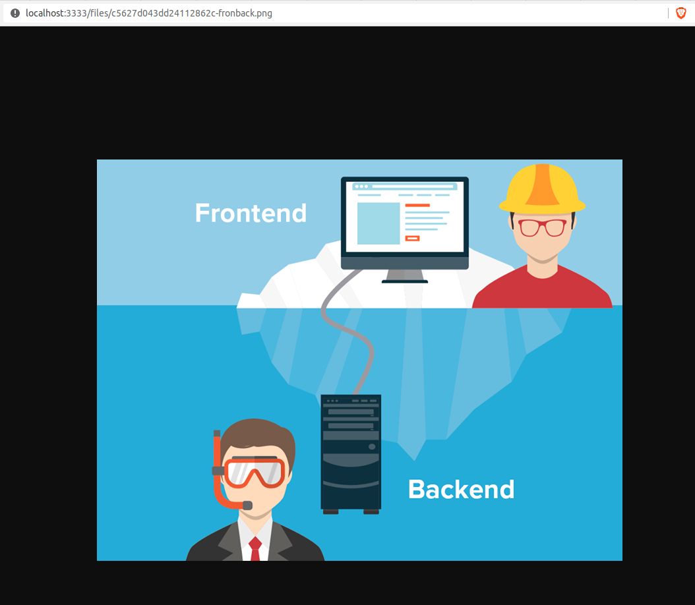

<h1>express-file-storage</h1>
<p>Estudo da ferramenta express para manipular aquivos e enviador para o servidor usando os verbos http</p>

<p>
  O Algoritimo desse estudo pega o arquivo enviado pelo cliente atravez do metodo POST, grava na pasta /tmp/uploads do servidor logo apos grava o caminho url do arquivo no banco de dados
</p>

<h2>Mas porque não gravar o arquivo diretamento no banco de dados?</h2>

<p>
  Não é uma boa pratica gravar os arquivos diretamente no banco de dados <strong>(isso é uma má prática enorme)</strong>, porque, além de ser mais "caro" armazenar no banco de dados, será mais lento para toda sua aplicação.</br>
  
  
  Isso pode trazer variros problemas como: sobrecarregar o banco de dados e torná-lo lento para todos os usuários, todos os backups e restaurações do seu banco demorará muito alem de usar muito...
  </br>
  O mais recomendavel e usar algum serviço de hospedagem para armazenar os arquivos como o S3 da amazon ou até o Google Storage e no banco de dados salvar a url dessa imagem para que seja possivel recuperar ela posteriormente.
  </br>
  No exemplo desse estudo foi usado a ideia de local, onde salvamos no proprio servidor aonde está rodando a aplicação.
</p>
</br>

<h2>Banco de dados para testar</h2>

```js
CREATE TABLE files (
  id INT AUTO_INCREMENT NOT NULL, 
  name VARCHAR (200),
  size VARCHAR (50),
  url VARCHAR (200),
  keyName VARCHAR (200),
  createAt DATE,
  PRIMARY KEY (id)
);
```
</br>

<h2>Middleware para manipulação de arquivos</h2>

<p>
Para que o express consiga manipular e entender os arquivos do multipart/form-data e necessário criar um middleware que nesse exemplo foi utilizado a biblioteca já criada o <a href="https://www.w3schools.com/tags/att_a_href.asp">multer</a> 
</br>

```js
const multer = require('multer');
const path = require('path');
const crypto = require("crypto");

const tpmFolder = path.resolve(__dirname, '..', '..', 'tmp','uploads')

module.exports = {
  directory: tpmFolder,
  storage: multer.diskStorage({
		destination: tpmFolder,
		filename(request, file, callback) {
			const fileHash = crypto.randomBytes(10).toString('hex');
			const fileName = `${fileHash}-${file.originalname}`;

			return callback(null, fileName);
		},
	}),
}
```

A cima podemos ver uma configuração simples de um middleware multer onde precisamdo de 2 argumentos o <strong> destination </strong> onde vai ser armazenar os arquivos enviados e o <strong>filename</strong> que será como o arquivo vai se chamar na hora de for salvo.<br>
<strong>Filename</strong> e uma função que espera 3 argumentos o request, file e uma função callback. </br>
A regra que utilizamos foi somente criar um hash random de 10 bytes e concatenar com o nome original, assim caso seja enviado o arquivos com o mesmo nome não e feito e duplicado o arquivo. Depois de renomear o arquivo e chamado a função callback que espera um erro e o nome do arquivo.
```js
	return callback(null, fileName);
```
No primerio argumento foi passado null pois não ocorreu erro e o segundo o nome novo do arquivo.
</p>

<h2>Método POST</h2>

<p>
  Depois de fazer todos os passos e somente pegar os dados necessário para gravar no banco de dados, pois as configurações acima somente gravar os arquivos no servidor. 
</br>

```js
  const routes = require('express').Router();
  const multer = require('multer');
  const multerConfig = require('./config/multer');
  const Post = require('./models/Post');

  routes.post('/posts', multer(multerConfig).single('file'), async (request, response) => {
    const {originalname: name, filename: keyName, size } = request.file;
    const dataurtl = process.env.APP_URL;
    const data = {
      name,
      size,
      keyName,
      url: dataurtl + keyName,
    }
    const post = await Post.insert(data);

    response.status(201).json({ message: post })
  });

  module.exports = routes;
```

Agora e a parte mais simples da aplicação aonde colocamos o middleware para que a rota possa entender o multipart/form-data e pegar os dados que precisamos para gravar no banco de dados.</br>
Precisamos importar o multer e o multerConfig que criamos, apos isso e somente colocar o multer como middleware. Ele esperar um argumento e vamos passar o nosso multerConfig de depois valos colocar ele como "single" pois vamos passar uma arquivo de cada vez.

```js
  const dataurtl = process.env.APP_URL;
  const data = {
    name,
    size,
    keyName,
    url: dataurtl + keyName,
  }
```

Podemos ver acima que a url estamos passando uma variavel de anbiente que tem o dendereço da api concatenando com o nome atual do arquivo. </br>

Para que seja possivel enviar os arquivos de volta para o cliente precisamos usar o express.static.

```js
require('dotenv').config();
const express = require('express');
const morgan = require('morgan');
const router = require('./router');
const path = require('path')


const app = express();

app.use(express.json());
app.use(express.urlencoded({extended: true}));
app.use(morgan('dev'));
app.use('/files', express.static(path.join(__dirname, '..', 'tmp', 'uploads')))

app.use(router);

app.listen(3333, () => console.log('servidor rodando na porta 3333'));

```

A baixo podemos ver o exemplo de como e rendereizado o arquivo om base na url passando o nome da imagem na url

<p align="center">
  
</p>
</p>

